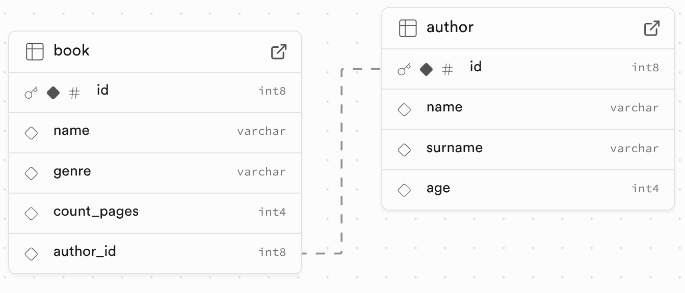

## Requirements
- **Python >= 3.10**
- You have to setup supabase project.
- Take the key that suits you best. For this example we recommend using `service_role`, but it is not suitable for production. You can read more [here](https://supabase.com/docs/guides/api/api-keys).

## Installation and setup the project
First of all you need to install the main dependencies:
```python
pip install supadantic fastapi uvicorn
```
Then add`SUPABASE_URL` and `SUPABASE_KEY` **env variables** to `.env`.

## Usage supadantic with FastAPI
Let’s define `book` and `author` tables in **supabase**:


Here is the full example of FastAPI application integrated with supadantic models:
```python
import uvicorn
from fastapi import FastAPI, HTTPException, status
from fastapi.responses import Response
from pydantic import BaseModel
from supadantic.models import BaseSBModel


app = FastAPI()


# Define supadantic models
class Author(BaseSBModel):
    name: str
    surname: str
    age: int


class Book(BaseSBModel):
    name: str
    genre: str
    count_pages: int | None = None
    author_id: int


# Define pydantic schemas
class CreateAuthor(BaseModel):
    name: str
    surname: str
    age: int


class UpdateAuthor(BaseModel):
    name: str | None = None
    surname: str | None = None
    age: int | None = None


class CreateBook(BaseModel):
    name: str
    genre: str
    count_pages: int


class UpdateBook(BaseModel):
    name: str | None = None
    genre: str | None = None
    count_pages: int | None = None


# Define endpoints
@app.get("/authors/")
def authors_list() -> list[Author]:
    return Author.objects.all()


@app.get("/authors/{id}/")
def retrieve_author(id: int) -> Author:
    try:
        return Author.objects.get(id=id)
    except Author.DoesNotExist:
        raise HTTPException(
            status_code=status.HTTP_404_NOT_FOUND, detail="Author not found."
        )


@app.post("/authors/")
def create_author(author: CreateAuthor) -> Author:
    return Author.objects.create(**author.model_dump())


@app.delete("/authors/{id}/")
def delete_author(id: int):
    try:
        Author.objects.get(id=id).delete()
        return Response(status_code=status.HTTP_204_NO_CONTENT)
    except Author.DoesNotExist:
        raise HTTPException(
            status_code=status.HTTP_404_NOT_FOUND, detail="Author not found."
        )


@app.patch("/authors/{id}/")
def update_author(id: int, data: UpdateAuthor):
    updated_data = data.model_dump(exclude_unset=True)
    author = Author.objects.filter(id=id)

    if not author.exists():
        raise HTTPException(
            status_code=status.HTTP_404_NOT_FOUND, detail="Author not found."
        )
    author.update(**updated_data)

    return Response(status_code=status.HTTP_204_NO_CONTENT)


@app.get("/authors/{author_id}/books/")
def author_book_list(author_id: int) -> list[Book]:
    if not Author.objects.filter(id=author_id).exists():
        raise HTTPException(
            status_code=status.HTTP_404_NOT_FOUND, detail="Author not found."
        )
    return Book.objects.filter(author_id=author_id)


@app.get("/authors/{author_id}/books/{id}/")
def retrieve_book(author_id: int, id: int) -> Book:
    if not Author.objects.filter(id=author_id).exists():
        raise HTTPException(
            status_code=status.HTTP_404_NOT_FOUND, detail="Author not found."
        )

    try:
        return Book.objects.get(id=id, author_id=author_id)
    except Book.DoesNotExist:
        raise HTTPException(
            status_code=status.HTTP_404_NOT_FOUND, detail="Book not found."
        )


@app.post("/authors/{author_id}/books/")
def create_book(author_id: int, book: CreateBook) -> Book:
    if not Author.objects.filter(id=author_id).exists():
        raise HTTPException(
            status_code=status.HTTP_404_NOT_FOUND, detail="Author not found."
        )
    return Book.objects.create(**book.model_dump(), author_id=author_id)


@app.patch("/authors/{author_id}/books/{id}/")
def update_book(author_id: int, id: int, data: UpdateBook):
    updated_data = data.model_dump(exclude_unset=True)
    if not Author.objects.filter(id=author_id).exists():
        raise HTTPException(
            status_code=status.HTTP_404_NOT_FOUND, detail="Author not found."
        )

    book = Book.objects.filter(id=id, author_id=author_id)
    if not book.exists():
        raise HTTPException(
            status_code=status.HTTP_404_NOT_FOUND, detail="Book not found"
        )
    book.update(**updated_data)

    return Response(status_code=status.HTTP_204_NO_CONTENT)


@app.delete("/authors/{author_id}/books/{id}/")
def delete_book(author_id: int, id: int):
    try:
        author = Author.objects.get(id=author_id)
        Book.objects.get(id=id, author_id=author.id).delete()
        return Response(status_code=status.HTTP_204_NO_CONTENT)
    except Author.DoesNotExist:
        raise HTTPException(
            status_code=status.HTTP_404_NOT_FOUND, detail="Author not found"
        )
    except Book.DoesNotExist:
        raise HTTPException(
            status_code=status.HTTP_404_NOT_FOUND, detail="Book not found"
        )


if __name__ == "__main__":
    uvicorn.run(app="main:app", host="localhost", port=8000, reload=True)
```

## Testing in supadantic via `CacheClient`
In `conftest.py` define the following **fixtures**:
```python
from unittest.mock import patch

import pytest
from supadantic.clients.cache import CacheClient
from supadantic.models import BaseSBModel

from main import Author


@pytest.fixture(scope="session", autouse=True)
def mock_db_client():
    with patch.object(BaseSBModel, "db_client", return_value=CacheClient:
        yield


@pytest.fixture(scope="function", autouse=True)
def clear_cache():
    yield
    Author.objects.all().delete()
```

Then create `test_author_api.py` module with following code:
```python
import pytest
from fastapi.testclient import TestClient

from main import Author, app


class TestAuthorAPI:
    @pytest.fixture
    def test_api_client(self):
        return TestClient(app)

    def test_get_authors(self, test_api_client: 'TestClient'):
        # Arrange
        author_1 = Author.objects.create(
            name='William', surname='Shakespeare', age=51
        )
        author_2 = Author.objects.create(
            name='Agatha', surname='Christie', age=85
        )

        # Act
        response = test_api_client.get("/authors/")

        assert response.status_code == 200
        assert response.json() == [
            {
                "id": author_1.id,
                "name": "William",
                "surname": "Shakespeare",
                "age": 51,
            },
            {
                "id": author_2.id,
                "name": "Agatha",
                "surname": "Christie",
                "age": 85,
            },
        ]

    def test_get_author_not_found(self, test_api_client: 'TestClient'):
        # Act
        response = test_api_client.get("/authors/1/")

        # Assert
        assert response.status_code == 404
        assert response.json() == {"detail": "Author not found."}

    def test_get_author(self, test_api_client: 'TestClient'):
        # Arrange
        author = Author.objects.create(name='J.K.', surname='Rowling', age=57)

        # Act
        response = test_api_client.get(f"/authors/{author.id}/")

        assert response.status_code == 200
        assert response.json() == {
            "id": author.id,
            "name": "J.K.",
            "surname": "Rowling",
            "age": 57,
        }

    def test_delete_author(self, test_api_client: 'TestClient'):
        # Arrange
        author = Author.objects.create(
            name='Ernest', surname='Hemingway', age=61
        )

        # Act
        response = test_api_client.delete(f"/authors/{author.id}/")

        # Assert
        assert response.status_code == 204
        assert not Author.objects.filter(id=author.id).exists()

    def test_delete_author_not_found(self, test_api_client: 'TestClient':
        # Act
        response = test_api_client.delete("/authors/9999/")

        # Assert
        assert response.status_code == 404
        assert response.json() == {"detail": "Author not found."}

    def test_create_author(self, test_api_client: 'TestClient'):
        # Act
        response = test_api_client.post(
            "/authors/",
            json={
                "name": "William",
                "surname": "Shakespeare",
                "age": 52,
            },
        )

        # Assert
        assert response.status_code == 200
        assert response.json() == {
            "id": response.json()["id"],
            "name": "William",
            "surname": "Shakespeare",
            "age": 52,
        }

        assert Author.objects.filter(
            id=response.json()["id"],
            name="William",
            surname="Shakespeare",
            age=52,
        )

    def test_update_author(self, test_api_client: "TestClient"):
        # Arrange
        author = Author.objects.create(
            name='Ernest', surname='Hemingway', age=61
        )

        # Act
        response = test_api_client.patch(
            f"/authors/{author.id}/",
            json={"age": 62},
        )

        # Assert
        assert response.status_code == 204
        assert Author.objects.filter(id=author.id, age=62).exists()
```
